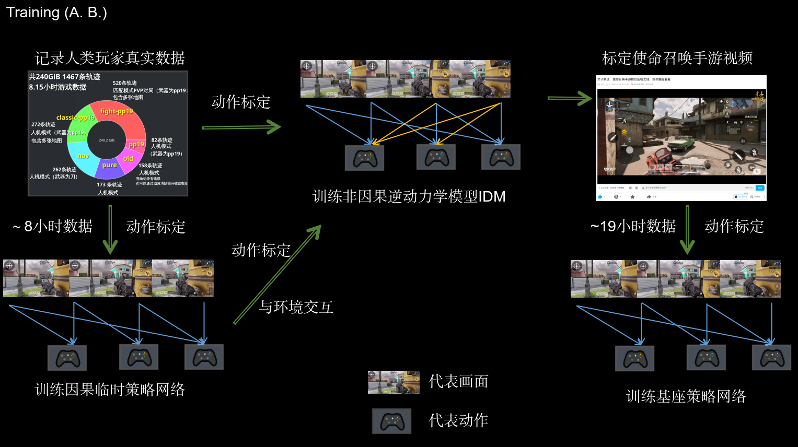
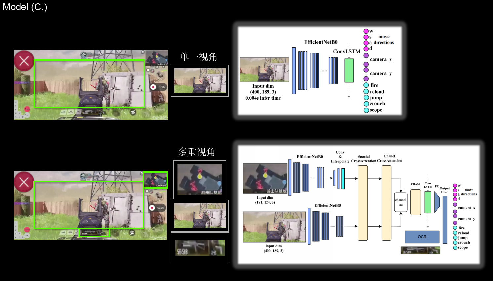

# SIRI-Agent: Visual Driven Policy for CODM

SIRI (Swift Insight Reinforce-Imitate) Agent is an AI system that performs visual imitation learning in the mobile game CODM (Call of Duty: Mobile).

## Demos
### SIRI-Agent Gameplay Demonstrations
1. [Bilibili Video](https://www.bilibili.com/video/BV1usE4zdERM)

 

2. Combat Situation 1

3. Combat Situation 2 (short)

4. Combat Situation 3 (short)

### Rule-based Method Comparison
Below is a demonstration of a rule-based approach using behavior trees and MiDaS depth information for navigation :

## Introduction
SIRI-Agent addresses the challenge of implementing AI agents in fps mobile games without API access. 

## Human-Annotated Dataset

Our comprehensive dataset includes:
- Total Size: 240 GiB
- Duration: ~8.15 hours
- Multiple scenarios and gameplay styles
- Carefully curated to ensure broad state coverage

## IDM
To scale our dataset efficiently, we Constructed a Inverse Dynamics Model (IDM) that automatically infers action sequences from raw gameplay footage.

## Model Architecture
Initially, we developed a Single-Aspect Policy Model based on the first-person perspective of the in-game character. Recognizing the critical role of the minimap dynamics and HUD information, we advanced to construct a Multi-Aspect Fusion Model and get better performance.

## License
This project is licensed under the MIT License - see the [LICENSE](LICENSE) file for details.