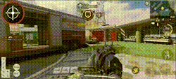
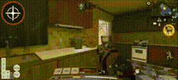
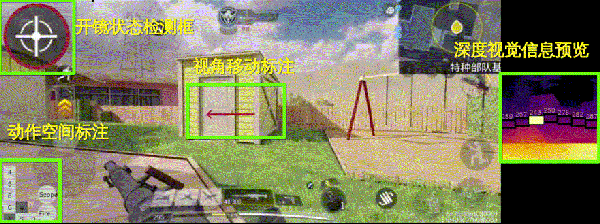
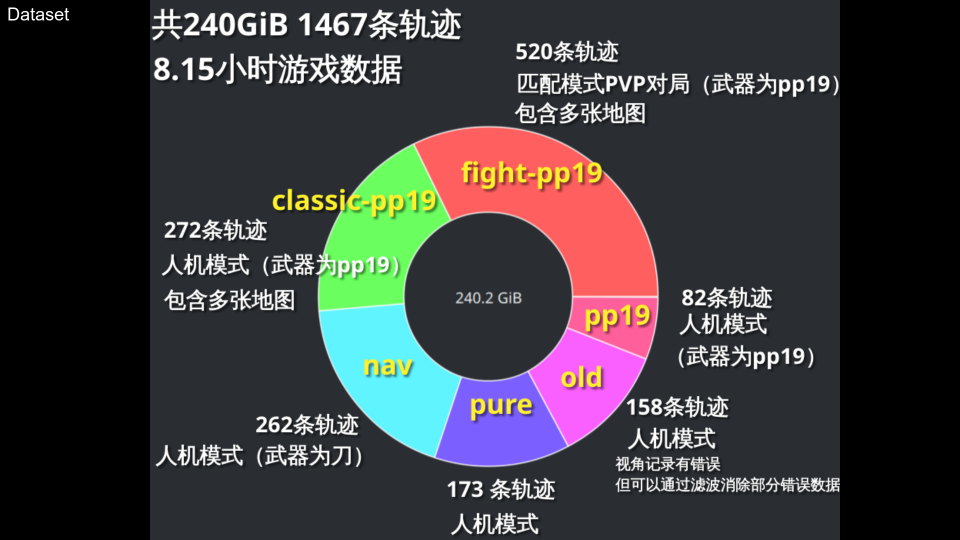
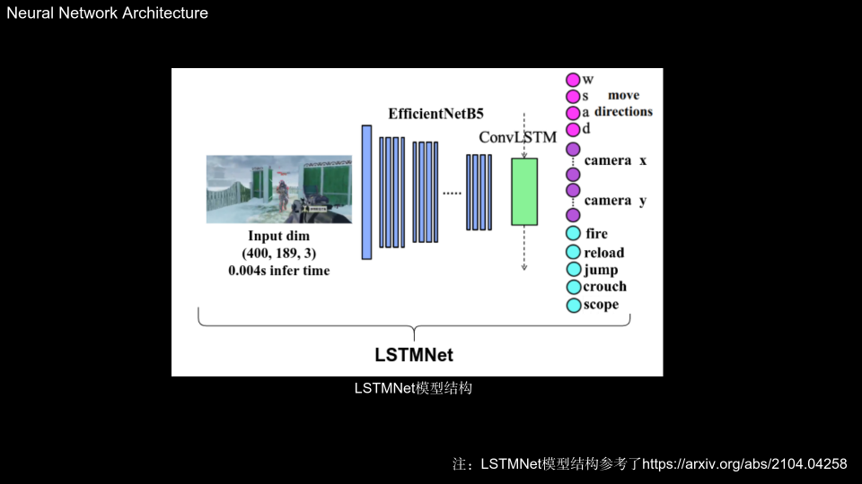
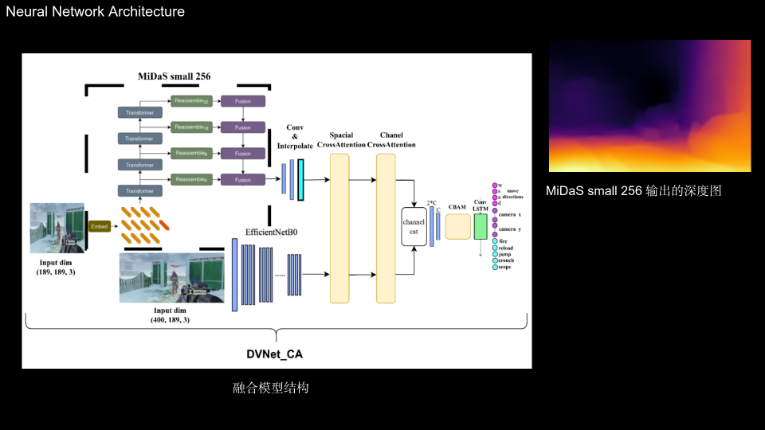

# SIRI-Agent: Visual Imitation Learning for CODM

SIRI (Swift Insight Reinforce-Imitate) Agent is an AI system that performs visual imitation learning in the mobile game CODM (Call of Duty: Mobile).

## Demos
### SIRI-Agent Gameplay Demonstrations
1. Combat Scenario 1

2. Combat Scenario 2 (short)

3. Combat Scenario 3 (short)

### Rule-based Method Comparison
Below is a demonstration of a rule-based approach using behavior trees and MiDaS depth information for navigation. While this method provides basic functionality, it shows limitations compared to our imitation learning approach:

## Introduction
SIRI-Agent addresses the challenge of implementing AI agents in mobile games without API access. Through pure visual imitation learning, it successfully replicates human gameplay in CODM while meeting real-time performance requirements.

## Dataset

Our comprehensive dataset includes:
- Total Size: 240 GiB
- Duration: ~8.15 hours
- Multiple scenarios and gameplay styles
- Carefully curated to ensure broad state coverage

## Model Architecture
We propose two network architectures:

### Lightweight Architecture

Our lightweight architecture focuses on real-time performance while maintaining accurate predictions.

### Enhanced Architecture

The enhanced architecture combines:
- EfficientNet for efficient feature extraction
- MiDaS for depth perception
- Feature fusion for improved understanding

## Features
- Pure vision-based imitation learning without API dependencies
- Real-time gameplay operation capabilities
- Lightweight model architecture for efficient processing
- Comprehensive state coverage through carefully curated datasets
- Mitigation of behavioral cloning cumulative error

## License
This project is licensed under the MIT License - see the [LICENSE](LICENSE) file for details.